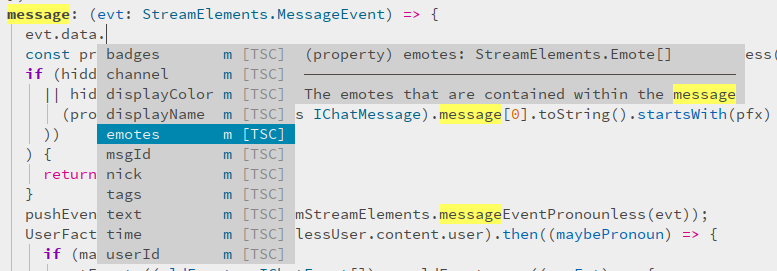

# 👨‍💻 streamelements-widget-events

Here at [plocca](https://plocca.com) we're trying to make developing widgets
for twitch easier, faster and hassle-free. A big part of our mission in
creating beautiful widgets for twitch is to help developers make better widgets
ourselves.

We're quite unhappy with _StreamElements_ APIs for creating widgets. To make
sure that you can make great widgets without the unsafety of their API, we're
incrementally sharing our code with the community by open sourcing it.

This is the first of a long chain of repos that we want to share with the
community!

## What is it?

This is a set of typescript interfaces for ensuring type safety with the
Streamelements Window Event JS APIs.

So, instead of writing:

```js
window.addEventListener('follower-latest', (evt) => {
  // What fields does evt have?
  // What do those fields mean?
});
```

you can write safe `typescript`:

```typescript
window.addEventListener(WindowEventType.FollowerLatest, (evt: EventObject)) {
  // We know what fields `evt` has and our editor tells us -- no need to google
  // back and forth:
  const detail = <FollowerLatestEvent>evt.detail;

  // All fields in detail are nicely documente and we know what they do!
  // For example, the JSDoc for detail.name says "Username of the follower"!
}
```

Check out how autocomplete works in my editor `nvim`:



Some common ways to get autocomplete working in your editor are:

* Via [Typescript in Visual Studio Code](https://code.visualstudio.com/docs/languages/typescript)
* Via [coc-tsserver for neovim](https://github.com/neoclide/coc-tsserver)

## Getting Started

Cool, you're on-board! Here's how you can get started!

First, grab the package off of the `npm`:
```bash
npm i --save @plocca/streamelements-widget-events
```

Then, in your `typescript` code, simply include it:

```typescript
import * as StreamElements from '@plocca/streamelements-widget-events';
```

## Usage

Now that you have the library, we'd recommend using the `delegateEvent`
function from it to handle your events. At plocca, we use it like so:

```typescript
const ourListener = (obj: StreamElements.EventObject) => StreamElements.delegateEvent(obj, {
  StreamElements.WindowEventType.FollowerLatest: (evt: StreamElements.FollowerLatestEvent) => {
    // Our super secret saucy code!
  },
  StreamElements.WindowEventType.Message: (evt: StreamElements.MessageEvent) => {
    // Our super secret saucy code!
  },
  // ... Maybe more!
});

window.addEventListener(StreamElements.WindowEvent.EventReceived, ourListener);
```

## Contributing

Please see the [CONTRIBUTING.md](./CONTRIBUTING.md) document for info on how to
contribute!

## License

This software is licensed under the MIT license! That means anyone can use it,
but we take no responsibility in this software's efficacy! See
[LICENSE.md](./LICENSE.md) for detailed info.
